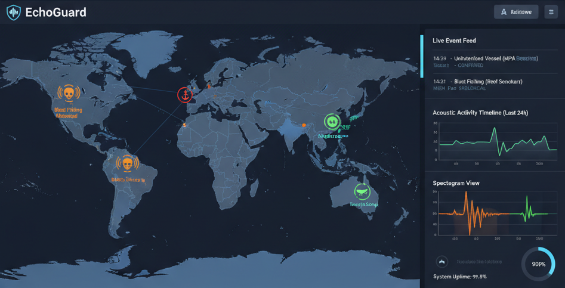

# **🌊 EchoGuard: AI-Powered Acoustic Sentry for Ocean Protection**

**EchoGuard is an open-source, AI-powered acoustic monitoring system that listens to the ocean's depths to automatically detect and report illegal or harmful activities in real-time.**

It acts as a 24/7 "sentry" for Marine Protected Areas (MPAs) and sensitive ecosystems, turning any hydrophone (underwater microphone) into an intelligent guard.



## **The Problem**

Our oceans are vast, and policing them is incredibly difficult. Marine Protected Areas (MPAs) are a cornerstone of conservation, but many are "paper parks"—protected on paper, but not in practice.

Illegal activities like **dynamite fishing**, **unauthorized vessel traffic**, and **seismic airgun surveying** cause irreversible damage. These threats often go undetected because:

1. **Vast Areas:** Patrol vessels can't be everywhere at once.  
2. **Data Overload:** Manually listening to months of underwater audio is impossible.  
3. **Lack of Real-Time Action:** By the time data is reviewed, the culprits are long gone.

## **The Solution**

EchoGuard processes audio from hydrophone networks in real-time. It uses a machine-learning-powered "acoustic-event detection" engine to distinguish the sounds of marine life from man-made threats.

When a threat is detected, EchoGuard can instantly send an alert with the event type, time, and (if available) location to researchers, enforcement agencies, or public dashboards.

## **Core Features**

* **🎧 Real-Time Audio Processing:** Ingests live audio streams from various hydrophone hardware or analyzes archived wav files.  
* **🤖 AI-Powered Threat Detection:** A core model trained to detect and classify key acoustic events, including:  
  * **Blast Fishing:** The unmistakable sound of underwater explosions.  
  * **Vessel Engines:** Differentiating between large commercial vessels, small boats, and speed profiles.  
  * **Seismic Airguns:** Loud, repetitive pulses from oil and gas exploration.  
  * **Marine Life:** Whale, dolphin, and other marine animal vocalizations.
* **🌍 Geospatial Alerting:** When integrated with a hydrophone array, it can help triangulate a sound's source and pin it to a map.  
* **📊 Interactive Dashboard:** A web interface to view live detections, explore historical data, and see a map of acoustic "hotspots."  
* **🔔 Real-Time Notifications:** WebSocket support for instant threat alerts and detection updates.
* **📈 Advanced Analytics:** Pattern detection, trend analysis, and correlation studies.
* **📤 Data Export:** Export detections and statistics in CSV, JSON, and Excel formats.

## **🚀 Quick Start**

### Prerequisites

- Docker and Docker Compose (recommended)
- OR Python 3.11+, Node.js 18+, PostgreSQL 14+ with PostGIS extension

### Quick Start with Docker

1. **Clone the repository**
   ```bash
   cd EchoGuard
   ```

2. **Create environment file**
   ```bash
   cp .env.example .env
   # Edit .env with your settings if needed
   ```

3. **Start services**
   ```bash
   docker-compose up -d
   ```

4. **Initialize database**
   ```bash
   docker-compose exec backend python scripts/init_db.py
   ```

5. **Create ML model**
   ```bash
   docker-compose exec backend python scripts/create_model.py
   ```

6. **Access the application**
   - **Dashboard**: http://localhost:3000
   - **API**: http://localhost:8000
   - **API Docs**: http://localhost:8000/docs

### Manual Setup (Without Docker)

#### Backend Setup

1. **Create virtual environment**
   ```bash
   python -m venv venv
   source venv/bin/activate  # On Windows: venv\Scripts\activate
   ```

2. **Install dependencies**
   ```bash
   pip install -r requirements.txt
   ```

3. **Setup PostgreSQL with PostGIS**
   ```bash
   # Create database
   createdb echoguard
   
   # Enable PostGIS extension
   psql -d echoguard -c "CREATE EXTENSION postgis;"
   ```

4. **Configure environment**
   ```bash
   cp .env.example .env
   # Edit .env with your database URL
   ```

5. **Initialize database**
   ```bash
   python scripts/init_db.py
   ```

6. **Create ML model**
   ```bash
   python scripts/create_model.py
   ```

7. **Run backend**
   ```bash
   uvicorn backend.main:app --reload
   ```

#### Frontend Setup

1. **Install dependencies**
   ```bash
   cd frontend
   npm install
   ```

2. **Run development server**
   ```bash
   npm run dev
   ```

## **🛠️ Technology Stack**

* **Audio Analysis & ML:**  
  * **Python** (Core)  
  * **Librosa:** For audio feature extraction (Spectrograms, MFCCs).  
  * **TensorFlow:** For building and serving the deep learning (CNN) models.  
* **Backend & Data Pipeline:**  
  * **FastAPI:** For serving the REST API for detections and dashboard data.  
  * **PostgreSQL + PostGIS:** To store detection events and geospatial data.  
  * **WebSockets:** For real-time updates and alerts.
* **Frontend:**  
  * **React + Vite:** To build the interactive visualization dashboard.  
  * **Material-UI:** For modern UI components.
  * **Leaflet.js:** For rendering the geospatial alert maps.
  * **Recharts:** For data visualization and charts.

## **📡 API Usage Examples**

### Upload and Analyze Audio

```bash
curl -X POST "http://localhost:8000/api/v1/audio/analyze" \
  -F "file=@sample.wav" \
  -F "hydrophone_id=1" \
  -F "latitude=37.7749" \
  -F "longitude=-122.4194"
```

### Batch Audio Processing

```bash
curl -X POST "http://localhost:8000/api/v1/audio/analyze/batch" \
  -F "files=@audio1.wav" \
  -F "files=@audio2.wav" \
  -F "hydrophone_id=1"
```

### Get Detections

```bash
curl "http://localhost:8000/api/v1/detections/?limit=10&is_threat=true"
```

### Export Data

```bash
# Export to CSV
curl "http://localhost:8000/api/v1/export/detections/csv?days=30" -o detections.csv

# Export to Excel
curl "http://localhost:8000/api/v1/export/detections/excel?days=30" -o detections.xlsx
```

### Real-Time WebSocket Connection

```javascript
const ws = new WebSocket('ws://localhost:8000/api/v1/ws');
ws.onmessage = (event) => {
  const data = JSON.parse(event.data);
  if (data.type === 'new_detection') {
    console.log('New detection:', data.data);
  }
  if (data.type === 'alert') {
    console.log('ALERT:', data.data);
  }
};
```

## **🎯 Key Features & Tools**

### Audio Processing
- **Single & Batch Analysis:** Process one or multiple audio files
- **Spectrogram Generation:** Visual frequency analysis
- **Waveform Visualization:** Amplitude over time plots
- **Audio Validation:** Format and integrity checking
- **Audio Download:** Retrieve original audio files

### Data Export
- **CSV Export:** Spreadsheet-compatible format
- **JSON Export:** Machine-readable format
- **Excel Export:** Professional reporting format
- **Statistics Reports:** Comprehensive analytics exports

### Hydrophone Management
- **Full CRUD Operations:** Create, read, update, delete hydrophones
- **Statistics Tracking:** Detection counts per hydrophone
- **Status Management:** Active, maintenance, offline states
- **Location Tracking:** Geospatial coordinates and depth

### Analytics & Statistics
- **Detection Trends:** Time-series analysis (hour/day/week/month)
- **Heatmap Analysis:** Geospatial clustering and hotspots
- **Pattern Detection:** Time of day, day of week patterns
- **Correlation Analysis:** Event type and location correlations
- **Summary Statistics:** Comprehensive analytics overview

### Real-Time Features
- **WebSocket Support:** Live detection updates
- **Instant Alerts:** Real-time threat notifications
- **Connection Management:** Multiple client support
- **Keep-Alive:** Automatic connection maintenance

### Notification Management
- **Alert Tracking:** Monitor all sent alerts
- **Status Monitoring:** Pending, sent, failed states
- **Resend Capability:** Retry failed alerts
- **Statistics:** Success rates and breakdowns

## **📊 API Endpoints Overview**

### Audio Processing
- `POST /api/v1/audio/analyze` - Analyze single audio file
- `POST /api/v1/audio/analyze/batch` - Batch audio processing
- `GET /api/v1/audio/info/{detection_id}` - Get audio metadata
- `GET /api/v1/audio/spectrogram/{detection_id}` - Generate spectrogram
- `GET /api/v1/audio/waveform/{detection_id}` - Generate waveform
- `GET /api/v1/audio/download/{detection_id}` - Download audio file

### Detections
- `GET /api/v1/detections/` - List detections with filters
- `GET /api/v1/detections/{id}` - Get single detection
- `GET /api/v1/detections/stats/summary` - Get statistics

### Dashboard
- `GET /api/v1/dashboard/map-data` - Map visualization data
- `GET /api/v1/dashboard/timeline` - Timeline data
- `GET /api/v1/dashboard/hydrophones` - Hydrophone locations

### Hydrophones
- `POST /api/v1/hydrophones/` - Create hydrophone
- `GET /api/v1/hydrophones/` - List hydrophones
- `GET /api/v1/hydrophones/{id}` - Get hydrophone
- `PUT /api/v1/hydrophones/{id}` - Update hydrophone
- `DELETE /api/v1/hydrophones/{id}` - Delete hydrophone
- `GET /api/v1/hydrophones/{id}/statistics` - Get statistics

### Export
- `GET /api/v1/export/detections/csv` - Export to CSV
- `GET /api/v1/export/detections/json` - Export to JSON
- `GET /api/v1/export/detections/excel` - Export to Excel
- `GET /api/v1/export/statistics/report` - Export statistics report

### Analytics
- `GET /api/v1/analytics/trends` - Detection trends
- `GET /api/v1/analytics/heatmap` - Geospatial heatmap
- `GET /api/v1/analytics/patterns` - Pattern analysis
- `GET /api/v1/analytics/correlations` - Correlation analysis
- `GET /api/v1/analytics/summary` - Analytics summary

### WebSocket
- `WS /api/v1/ws` - Real-time updates
- `WS /api/v1/ws/detections` - Detection updates only
- `GET /api/v1/ws/status` - Connection status

### Notifications
- `GET /api/v1/notifications/alerts` - List alerts
- `GET /api/v1/notifications/alerts/{id}` - Get alert
- `POST /api/v1/notifications/alerts/{detection_id}/resend` - Resend alert
- `GET /api/v1/notifications/alerts/stats` - Alert statistics

**Interactive API Documentation:** Visit `http://localhost:8000/docs` for complete Swagger/OpenAPI documentation.

## **🗺️ Project Structure**

```
EchoGuard/
├── backend/              # Python FastAPI backend
│   ├── ml/              # Machine Learning models
│   ├── routers/         # API route handlers
│   ├── services/        # Business logic services
│   └── utils/           # Utility functions
├── frontend/            # React frontend application
├── scripts/             # Utility scripts
├── models/              # ML model storage
├── uploads/             # Uploaded audio files
└── alembic/             # Database migrations
```

## **🔧 Development**

### Database Migrations

```bash
# Create migration
alembic revision --autogenerate -m "description"

# Apply migrations
alembic upgrade head
```

### Using Makefile

```bash
make setup       # Initial setup
make build       # Build Docker images
make up          # Start services
make down        # Stop services
make logs        # View logs
make init-db     # Initialize database
make create-model # Create ML model
```

## **🐛 Troubleshooting**

### Database Connection Issues
- Ensure PostgreSQL is running
- Check DATABASE_URL in .env file
- Verify PostGIS extension is installed

### ML Model Issues
- Model will be created automatically on first run
- For production, train model with real acoustic data
- Model file location: `./models/echoguard_model.h5`

### Port Conflicts
- Change ports in docker-compose.yml or .env file
- Backend default: 8000
- Frontend default: 3000
- Database default: 5432

## **🚀 Production Deployment**

1. Set `API_RELOAD=false` in production
2. Use production database with proper credentials
3. Configure CORS_ORIGINS for your domain
4. Set up proper SSL/TLS certificates
5. Use a reverse proxy (nginx) for frontend
6. Configure alert webhooks
7. Set up monitoring and logging
8. Train ML model with production data

## **🤝 Contributing**

**We need your help to build this.** Whether you are a data scientist, backend engineer, frontend developer, or a marine biologist with an idea, you are welcome here.

### Areas for Contribution
- ML model training and improvement
- Additional event type classifications
- Hardware integration (Raspberry Pi, hydrophone devices)
- Frontend enhancements
- Documentation improvements
- Testing and bug fixes

## **📝 License**

This project is licensed under the **MIT License**. See the [LICENSE](LICENSE) file for details.

## **🔮 Roadmap**

* **Phase 1: Core Model** ✅
  * [x] Aggregate and standardize open-source audio datasets
  * [x] Train and validate a V1 classification model
  * [x] Create Python library to run inference on audio files
* **Phase 2: Data Pipeline** ✅
  * [x] Build the backend API to receive audio chunks or files
  * [x] Create the database schema for storing event data
  * [x] Containerize the model and API for easy deployment (Docker)
* **Phase 3: Dashboard** ✅
  * [x] Design the frontend UI/UX
  * [x] Build the dashboard components (map, event list, spectrogram viewer)
  * [x] Connect the frontend to the backend API
* **Phase 4: Real-Time Streaming** ✅
  * [x] Implement streaming ingest service (WebSockets)
  * [ ] Develop hardware-specific connectors for common hydrophones
* **Phase 5: Advanced Features** (In Progress)
  * [ ] Email/SMS notification support
  * [ ] Advanced ML model training endpoints
  * [ ] User authentication and authorization
  * [ ] API rate limiting
  * [ ] Scheduled report generation

---

**Made with 🌊 for ocean protection**
